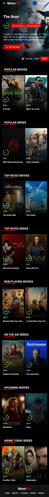
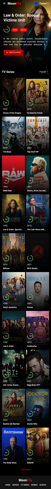
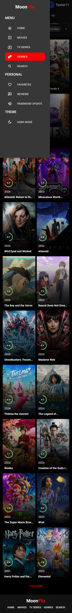

# Movies Website: MoonFlix

This project utilizes the MERN (MongoDB, Express.js, React.js, Node.js) stack to create a comprehensive platform for exploring entertainment content. Leveraging the TMDB API, it provides detailed information about movies, TV series, and personalities. The user interface is designed using Material-UI (MUI), ensuring a modern and intuitive experience. Whether you're looking for the latest movies, binge-worthy TV shows, or insights into your favorite actors, our website offers a seamless way to discover and explore entertainment content.

## Table of Contents

- [Introduction](#introduction)
- [Features](#features)
- [Technologies](#technologies)
- [Installation](#installation)
- [Screenshots](#screenshots)
- [Acknowledgements](#acknowledgements)

## Introduction

MoonFlix is a comprehensive platform designed to explore and discover information about movies, TV shows, and personalities. Leveraging the TMDB API, the website offers a seamless user experience with a focus on detailed content and intuitive navigation.

The purpose of is to provide users with a centralized hub where they can access detailed information about:

- Movies: Explore details such as plot summaries, cast members, ratings, and release dates.
- TV Shows: Discover information about seasons, episodes, cast members, and more.
- Persons: Explore information about actors and their credits within the entertainment industry.

## Features

- **Trending Section:**
  Display trending movies and web series.

- **Media Categories:**
  - Popular
  - Top Rated
  - Now Playing
  - Upcoming

- **Detailed Media Pages:**
  Each media page includes:
  - Poster
  - Overview
  - Cast
  - Videos
  - Backdrops
  - Reviews
  - Recommendations

- **Detailed Persons Pages:**
  Each person's page includes:
  - Biography
  - Credits

- **Filtering:**
  Filter content based on genres.

- **Sorting Options:**
  Sort content by criteria such as:
  - Vote Count
  - Popularity
  - Revenue

- **Search Functionality:**
  Search for movies, TV series, and persons.

- **User Authentication:**
  - Sign In
  - Sign Up
  - Password Reset

- **User Interaction:**
  - Favorite Lists
  - User Reviews

## Technologies

### Technologies and Libraries Used

#### Frontend:
- **React.js** - JavaScript library for building user interfaces. [Reference](https://reactjs.org/)
- **HTML/CSS** - Standard web technologies for structuring and styling web pages.
- **Material-UI (MUI)** - React components library for building UI components. [Reference](https://mui.com/)

#### Backend:
- **Node.js** - JavaScript runtime for server-side applications. [Reference](https://nodejs.org/)
- **Express.js** - Web framework for Node.js, used for building APIs and handling HTTP requests. [Reference](https://expressjs.com/)
- **MongoDB** - NoSQL database used for storing application data. [Reference](https://www.mongodb.com/)

#### Other Tools and Libraries:
- **axios** - HTTP client for making requests to the TMDB API and server. [GitHub](https://github.com/axios/axios)
- **jsonwebtoken** - Library for generating and verifying JSON Web Tokens (JWTs) for authentication. [GitHub](https://github.com/auth0/node-jsonwebtoken)
- **mongoose** - ODM library for MongoDB and Node.js. [Reference](https://mongoosejs.com/)
- **react-router-dom** - DOM bindings for React Router, for handling navigation and routing. [GitHub](https://github.com/ReactTraining/react-router)
- **react-redux** - Official Redux binding for React to manage state. [GitHub](https://github.com/reduxjs/react-redux)
- **formik** - Form library for React. [GitHub](https://github.com/formium/formik)
- **yup** - Schema validation library for JavaScript objects. [GitHub](https://github.com/jquense/yup)
- **The Movie Database (TMDB)** - API for retrieving movie and TV show data. [Reference](https://www.themoviedb.org/)

## Installation

### Prerequisites
Before starting, ensure you have the following installed:
- **Node.js**: Download and install Node.js from [nodejs.org](https://nodejs.org/), which includes npm.

### Step 1: Clone the Repository
Clone the project repository from GitHub:

```bash
git clone https://github.com/Nikhil241103/Movies-Website.git
cd Movies-Website
```

### Step 2: Install Dependencies
Client (Frontend)
````bash
cd client
npm install
````

Server (Backend)
```bash
cd ../server
npm install
````

### Step 3: Set Up Environment Variables
- Create a .env file in the server directory according to .env.example file.
- Update the variables in .env as necessary for your local setup. Ensure you add .env to your .gitignore file to keep sensitive information secure.

### Step 4: Run the Development Servers
Client (Frontend)
````bash
cd client
npm start
````
Access the frontend at http://localhost:3000.

Server (Backend)
````bash
cd ../server
npm start
````
The backend runs at http://localhost:5000.

### Step 5: Accessing the Application
Open your web browser and go to http://localhost:3000 to view the frontend application.

## Screenshots

### Desktop

#### Home Page


#### Movies Page


#### Genres Page


#### Media Details


### Mobile

#### Home Page


#### TV Page


#### Genres Page


#### Sidebar


## Acknowledgements

- **Video Tutorial**: I would like to acknowledge the YouTube video tutorial by [Tran Anh Tuat](https://www.youtube.com/watch?v=j-Sn1b4OlLA) for providing valuable insights during the development of this project.

- **GitHub Repository**: I referenced code and ideas from the GitHub repository by Tran Anh Tuat at [github.com/trananhtuat/fullstack-mern-movie-2022](https://github.com/trananhtuat/fullstack-mern-movie-2022). It served as a helpful resource throughout the development process.

